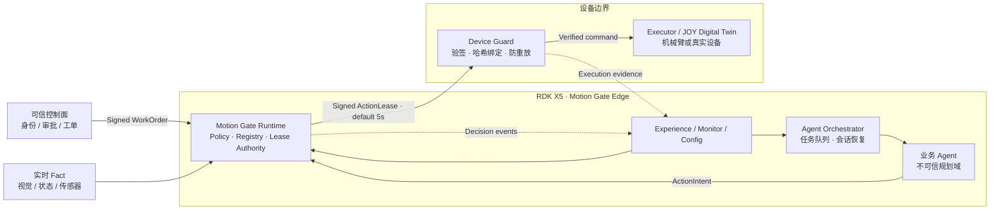

# Motion Gate

### 面向具身 Agent 的零信任执行边界

**Agent 可以提出动作，但不能自行获得执行权。**

Motion Gate 部署在 AI Agent 与真实设备之间。它将 Agent 生成的动作意图，与组织策略、已签名工单、实时环境事实和设备状态进行独立核对；只有满足全部约束的动作，才能获得短时、单次、与请求内容绑定的执行凭证。

它不尝试判断模型“是否善意”，也不依赖某一种提示词注入检测器。即使 Agent 因提示词注入、模型幻觉、恶意工具或调用链篡改而生成危险动作，设备侧仍会在物理执行前验证其执行权。

> **定位：** Motion Gate 是执行安全基础设施，不是业务 Agent、模型防火墙或异常检测算法。

---

## 为什么需要独立执行层

Agent 内部的提示词过滤、内容审核和工具白名单都很重要，但它们与被保护的 Agent 处于同一信任域。一旦模型上下文、插件、依赖或业务编排被绕过，Agent 仍可能向设备提交结构正确但业务越权的动作。

Motion Gate 将“生成动作”和“授予执行权”拆开：

| 业务 Agent 负责 | Motion Gate 负责 |
|---|---|
| 理解目标、规划任务、调用工具 | 验证主体、工单、资源、参数、实时事实和执行预算 |
| 生成结构化 `ActionIntent` | 决定是否签发一次性 `ActionLease` |
| 根据结果继续规划 | 在设备边界验签、防重放、记录执行结果 |

LLM 的输出始终被视为不可信输入。自然语言、模型自述、语音命令和 Agent 的“管理员声明”都不能直接产生设备权限。

---

## 系统架构



参考部署将控制职责分散到三个信任域：

| 节点 | 运行内容 | 不持有的能力 |
|---|---|---|
| **RDK X5** | Agent、Orchestrator、Runtime、策略、Fact Hub、Web 服务 | 不直接驱动 Windows 执行器 |
| **Windows 设备侧** | Device Guard、JOY 适配器、机械臂数字孪生 | 不运行 Policy 或业务 Agent |
| **浏览器终端** | 嘉宾体验、可信配置、安全观测 | 不保存 Runtime Lease 私钥 |

Runtime 仅从显式允许列表发现 Guard。设备发现只更新连接与就绪证据，不会自动授权或触发动作。

---

## 核心执行协议

Motion Gate 使用三个相互绑定的对象建立执行权：

### 1. Signed WorkOrder

可信控制面签发的短期授权，限定主体、动作、资源、参数、有效期和最大执行次数。

```json
{
  "schema_version": "safeexec.work-order.v1",
  "work_order_id": "16e25368-0948-4e31-9863-94f6488d31de",
  "issuer_id": "biolab-control-plane",
  "subject_principal_id": "lab-agent-01",
  "issued_at_ms": 1784800000000,
  "valid_from_ms": 1784800000000,
  "valid_until_ms": 1784803600125,
  "nonce": "72f466a9e3234efc83f29eedb38e3ae7",
  "grants": [
    {
      "grant_id": "sample-a-analysis",
      "action": "lab.sample.transfer",
      "resource": {"type": "lab.sample", "id": "sample-A"},
      "arguments": {
        "source": "cold-storage",
        "destination": "analyzer-01"
      },
      "required_facts": [
        {
          "key": "guard.joy.ready",
          "equals": true,
          "max_age_ms": 5000
        }
      ],
      "max_executions": 1
    }
  ],
  "operator_note": "将 sample-A 从等候区送往分析区",
  "key_id": "biolab-control-plane-key-01",
  "signature": "base64url-ed25519-signature"
}
```

### 2. ActionIntent

Agent 提交的动作提案。它必须引用已验证的 WorkOrder，但引用本身不代表已经获得授权。

```json
{
  "schema_version": "safeexec.action.v2",
  "request_id": "d7588eb9-f22c-49a7-9814-b46260e19d8e",
  "principal_id": "lab-agent-01",
  "work_order_id": "16e25368-0948-4e31-9863-94f6488d31de",
  "issued_at_ms": 1784800000125,
  "action": "lab.sample.transfer",
  "resource": {"type": "lab.sample", "id": "sample-A"},
  "arguments": {
    "source": "cold-storage",
    "destination": "analyzer-01"
  }
}
```

### 3. ActionLease

Runtime 在策略允许后签发的 Ed25519 凭证。Lease 默认 5 秒有效，只能消费一次，并通过 `request_hash` 绑定完整 ActionIntent。

```json
{
  "schema_version": "safeexec.lease.v1",
  "lease_id": "f49fb2ab-853c-4c10-95aa-ef9ae7e34621",
  "request_id": "d7588eb9-f22c-49a7-9814-b46260e19d8e",
  "request_hash": "sha256:...",
  "principal_id": "lab-agent-01",
  "audience": "joy-guard-01",
  "mission_id": "mission-biolab-x5-edge-controller-001",
  "decision_id": "8faf0e2a-2321-4fa9-8369-f39dbe0c7e77",
  "issued_at_ms": 1784800000200,
  "expires_at_ms": 1784800005200,
  "nonce": "1a650d58a6f645748120f04eed29d682",
  "key_id": "x5-runtime-key-01",
  "signature": "base64url-ed25519-signature"
}
```

执行流程：

1. 控制面签发 WorkOrder，Runtime 验证签发方、主体、范围、有效期和预算。
2. Agent 提交 ActionIntent。
3. Policy Engine 对 OrganizationPolicy、WorkOrder、ActionIntent 与实时 Fact 做精确匹配。
4. 允许时，Lease Authority 签发与请求哈希绑定的一次性 ActionLease。
5. Device Guard 再次验证签名、audience、时间、请求哈希和消费状态。
6. 验证通过后调用 Executor，并将判定与物理结果写入事件流。

任一步缺失、过期、不一致或无法确认，系统都不会继续扩大权限。

---

## 安全不变量

| 不变量 | 实现 |
|---|---|
| **Agent 不持有执行私钥** | Lease 私钥只存在于独立 Runtime 身份中 |
| **长期策略与短期工单必须同时允许** | OrganizationPolicy 和 Signed WorkOrder 双层授权 |
| **授权精确绑定动作内容** | ActionLease 包含完整 ActionIntent 的 SHA-256 哈希 |
| **一次授权只执行一次** | Guard 使用 SQLite 原子消费 Lease，阻断并发重放 |
| **设备侧独立验证** | Guard 在调用 Executor 前重新验签，不信任上游“已批准”标记 |
| **不确定结果不按成功处理** | 连接中断时返回 `EXECUTION_OUTCOME_UNKNOWN`，保守消耗预算并锁定产线 |
| **跨设备时间异常提前失败** | X5 与 Guard 时钟偏差超过 2 秒时，Runtime 在签发前拒绝执行端 |
| **签名复位也经过相同边界** | `lab.line.reset` 仍需 Policy、Lease 与 Guard 验证 |

### 失败关闭

以下情况默认拒绝或锁定执行链：

- 未登记主体或未知动作；
- WorkOrder 缺失、签名无效、已过期或预算耗尽；
- 动作、资源、来源、目标或 `work_order_id` 不匹配；
- 必需 Fact 缺失、过期或值不满足策略；
- Guard、Executor 或深度就绪检查不可用；
- Lease 过期、重放、audience 错误或请求哈希不一致；
- Lease 签发后无法确认物理执行结果。

---

## 已覆盖的攻击路径

| 风险 | 攻击结果 | 截断位置 |
|---|---|---|
| **提示词注入** | 污染会话生成工单外动作，Runtime 不签发 Lease | Runtime |
| **模型幻觉** | 结构正确但授权范围外的目标被拒绝 | Runtime |
| **Intent 途中篡改** | Lease 签发后替换目标，触发 `REQUEST_HASH_MISMATCH` | Device Guard |
| **Lease 重放** | 重复提交已消费 Lease，触发 `LEASE_ALREADY_CONSUMED` | Device Guard |
| **过期 Lease** | 超出有效期的凭证不能抵达 Executor | Device Guard |
| **执行端掉线** | 无新 Lease；结果不确定时进入人工核验状态 | Runtime / Orchestrator |

提示词注入只是演示入口之一。Motion Gate 的判定对象是最终结构化动作及其执行权，而不是攻击文本的写法。

---

## 自主恢复

在已登记的攻击测试中，Orchestrator 可以对可确认的策略拒绝执行一次受限恢复：

1. 标记并销毁污染 Agent 会话；
2. 保留可信 WorkOrder，不携带攻击上下文；
3. 创建干净会话，重新规划同一业务任务；
4. 再次经过 Motion Gate 完整授权链；
5. 成功后继续后续队列。

只有已登记注入且返回预期策略拒绝时允许自动恢复。Fact 过期、Guard 离线、执行失败或物理结果不确定时不会无限重试，而是进入 `ERROR` 等待人工核验。

---

## 现场演示

JOY 场景模拟一条持续运行的实验室样品生产线。六个样品先作为完整批次进入分析区，整批完成后再通过签名 `lab.line.reset` 原子换线，不会逐件搬回后立即刷新。

三屏展示职责分离：

| 屏幕 | 地址 | 用途 |
|---|---|---|
| **嘉宾体验** | `http://<X5_IP>:8787/experience` | 选择攻击并观察输入、判定和物理结果 |
| **安全观测墙** | `http://<X5_IP>:8787/monitor` | 只读展示安全评分、阻断层、攻击矩阵和实时审计 |
| **可信配置** | `http://<X5_IP>:8787/config` | 签发并激活受范围约束的 WorkOrder |

观测墙中的安全评分由当前组件健康、保护模式、危险结果和恢复证据计算，仅用于现场解释，不代表安全认证。

无保护 A/B 路径默认关闭。只有显式启用 unsafe demo、提供 Token 且产线处于停止状态时，才能将同一 Agent 意图发送到隔离的 Legacy Bridge。该路径只用于证明安全边界的效果，不属于生产架构。

---

## 快速开始

### 环境要求

- Python 3.10+
- Linux、macOS 或 WSL 开发环境
- `PyNaCl`、`PyYAML`
- 可选：RDK X5、Windows JOY 数字孪生

### 本地服务

```bash
git clone https://github.com/SCW5370/hackthon.git
cd hackthon

python3 -m venv .venv
.venv/bin/pip install -r requirements.txt

mkdir -p .run
.venv/bin/python scripts/gen_keys.py \
  --private-key .run/private_key.txt \
  --public-key .run/public_key.txt

.venv/bin/python scripts/gen_keys.py \
  --private-key .run/work_order_private_key.txt \
  --public-key .run/work_order_public_key.txt

SAFEEXEC_GUARD_URL=http://<GUARD_IP>:8788 ./scripts/start_stack.sh
```

默认端口：

| 服务 | 端口 |
|---|---:|
| Exhibition Web | `8787` |
| Orchestrator | `8789` |
| Motion Gate Runtime | `8790` |
| Windows Device Guard | `8788` |
| JOY RPC | `18189` |
| Legacy Bridge（仅 A/B） | `8791` |

### RDK X5 边缘部署

```bash
cd /opt/safeexec
./scripts/configure_x5_identity.sh
./scripts/install_x5_edge.sh
./scripts/start_x5_edge.sh
./scripts/preflight_demo.sh
```

安装脚本会创建并启用：

- `safeexec-runtime.service`
- `safeexec-orchestrator.service`
- `safeexec-dashboard.service`
- `safeexec-healthcheck.timer`

需要进行“关闭 Motion Gate”的 A/B 演示时，在 Windows 上以管理员
PowerShell 安装独立的 Legacy Baseline 常驻任务。Token 只在安装时传入，
之后保存在当前用户独占的 `.run/legacy_token.txt` 中；任务会等待 JOY RPC
就绪，并在异常退出或重新登录后自动拉起，不弹出轮询窗口。

```powershell
.\scripts\install_windows_legacy_task.ps1 -Token "<与 X5 一致的演示 Token>"
```

完整的 X5、Windows Guard 和 JOY 联调流程见 [端到端部署指南](docs/e2e-integration.md)。

---

## API 概览

### Motion Gate Runtime

| Method | Endpoint | 说明 |
|---|---|---|
| `POST` | `/v1/actions` | 提交 ActionIntent 并执行策略判定 |
| `POST` | `/v1/work-orders` | 注册并验证 Signed WorkOrder |
| `GET` | `/v1/work-orders/{id}` | 查询工单范围与剩余预算 |
| `POST` | `/v1/facts` | 发布带 TTL 的实时 Fact |
| `GET` | `/v1/state` | 查询事实和最近动作摘要 |
| `GET` | `/v1/events` | 读取 Runtime 判定事件 |
| `GET` | `/readyz` | 检查 Runtime、Guard 与 Executor 深度就绪 |

### Device Guard

| Method | Endpoint | 说明 |
|---|---|---|
| `POST` | `/v1/execute` | 验证并原子消费 Lease 后调用 Executor |
| `GET` | `/v1/physical` | 查询当前物理状态证据 |
| `GET` | `/v1/events` | 读取 Guard 验证与执行事件 |
| `GET` | `/readyz` | 查询 Guard 和本地 Executor 深度就绪 |

### Orchestrator

| Method | Endpoint | 说明 |
|---|---|---|
| `GET` | `/v1/line/state` | 查询生产线、任务、会话和计数器 |
| `GET` | `/v1/preflight` | 启动前全链路检查 |
| `POST` | `/v1/control/start` | 启动任务队列 |
| `POST` | `/v1/control/pause` | 当前动作结束后协作式暂停 |
| `POST` | `/v1/control/resume` | 继续任务队列 |
| `POST` | `/v1/control/reset` | 通过签名执行路径复位 |
| `GET` | `/v1/events/stream` | SSE 增量事件流 |

完整数据结构位于 [`contracts/`](contracts/)；协议字段采用严格白名单，未知字段和原始坐标不会被静默下传到设备。

---

## 密钥与信任边界

| 密钥 | 保存位置 | 用途 |
|---|---|---|
| Lease private key | Motion Gate Runtime | 签发 ActionLease |
| Lease public key | Device Guard | 验证 ActionLease |
| WorkOrder private key | 可信控制面或 KMS | 签发 WorkOrder |
| WorkOrder public key | Motion Gate Runtime | 验证 WorkOrder |

私钥不得提交到代码仓库、Agent 环境或 Dashboard 前端。参考部署通过独立 Linux 服务账号隔离 Agent、Runtime 与可信控制面；生产环境应使用外部身份系统、KMS/HSM 和密钥轮换机制。

---

## 可观测性与韧性

- SSE 事件以单调递增 `seq` 增量传输，页面不会周期性清空重绘；
- Dashboard、Runtime 和 Orchestrator 由 systemd 自动拉起；
- 健康检查区分“进程存活”和“设备深度就绪”；
- Guard 在长时间物理动作中显式报告 `executing`，不会被误判为掉线；
- Runtime 检查 X5 与 Guard 的时钟偏差，避免短时 Lease 因跨设备漂移失效；
- Guard/JOY 离线只会让 Runtime 失败关闭，不会触发自动物理动作；
- 浏览器断线重连使用最后事件序号校准，不重复审计节点。

---

## 验证

```bash
.venv/bin/python -m unittest discover -s tests -v
bash -n scripts/*.sh
```

当前版本包含 **111 项自动化测试**，覆盖：

- Policy、WorkOrder、Lease 和 Fact 匹配；
- 签名、哈希绑定、防重放与并发消费；
- 动态任务编译、连续批次、暂停与签名复位；
- 攻击注入、污染会话销毁和受限恢复；
- Guard/JOY 连接丢失与未知物理结果；
- Dashboard 安全渲染、挑战历史和只读观测墙；
- X5 与 Windows 执行端发现、时钟偏差和长动作就绪。

参考实机验收目标：

```text
protected mode:
  blocked_actions  >= 1
  recovered_tasks  >= 1
  unsafe_outcomes  = 0

unsafe A/B mode:
  same malicious intent reaches isolated waste-bin path
```

---

## 仓库结构

```text
runtime/       Policy、Fact Hub、WorkOrder Registry、Lease Authority
guard/         设备侧验签、防重放和 Executor 边界
orchestrator/  任务队列、Agent 会话、恢复和事件流
lab_agent/     业务 Agent 数据契约与 Provider
adapters/      RDK 感知与实时 Fact 适配
joy/           JOY 机械臂数字孪生和设备适配器
console/       体验页、观测墙和可信配置页
contracts/     攻击、动作和集成数据契约
deploy/        systemd 服务定义
scripts/       部署、启动、预检和恢复工具
tests/         单元、集成与安全回归测试
```

---

## 协议兼容性

**Motion Gate** 是产品名称。为保持现有集成稳定，当前版本继续使用 `safeexec.*` Schema、`SAFEEXEC_` 环境变量、`/opt/safeexec` 部署目录和既有 systemd 服务名。它们是协议与部署兼容标识，不代表另一套产品。

---

## 生产部署要求

本仓库是可运行的安全参考实现，不应在未经加固的情况下直接控制高风险设备。生产接入至少需要：

1. 由 OS、网络或设备固件保证 Guard 是 Executor 的唯一入口；
2. 为控制面、Runtime 和 Guard 配置双向 TLS 与服务身份；
3. 将 WorkOrder 和 Lease 私钥迁移到 KMS/HSM；
4. 使用可信时间源并监控跨设备时钟偏差；
5. 将事件写入外部、持久化、可防篡改的审计系统；
6. 按设备风险增加速度、力矩、空间区域和急停等硬约束；
7. 对 Policy、适配器和恢复策略进行独立安全评审。

本地演示默认使用隔离局域网 HTTP。不要将 `8787`、`8788`、`8789`、`8790` 或 JOY RPC 直接暴露到公共网络。

---

## 文档

- [X5、Windows Guard 与 JOY 端到端部署](docs/e2e-integration.md)
- [Windows JOY 设备侧说明](docs/joy-windows.md)
- [Lab Agent 接入](docs/lab-agent.md)
- [AttackLab 数据契约](docs/attacklab-integration.md)
- [贡献与安全评审要求](CONTRIBUTING.md)
